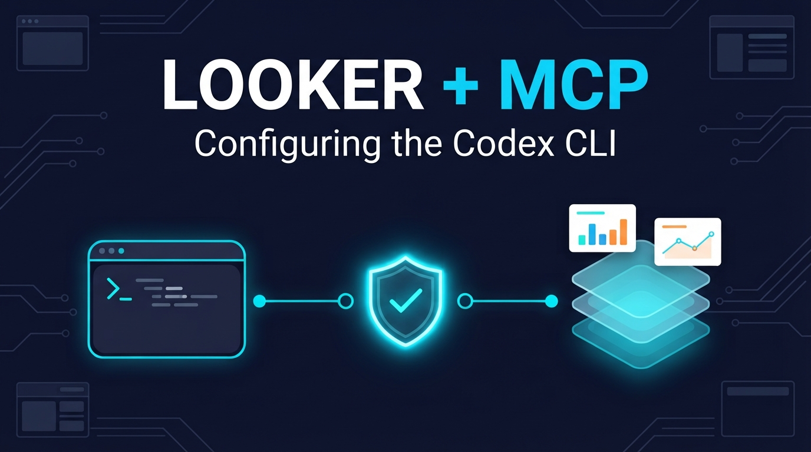

<!--
Cover art: docs/images/cover-codex.jpg — generated with NB2Lite
(gemini-3.1-flash-lite-image, Interactions API), then refined with one stateful
edit. Upload it and set `cover_image:` above to the hosted URL before publishing.
Alternate first pass kept at docs/images/cover-codex-v1.jpg.
-->


This article covers the MCP setup and configuration for using Looker with Codex to enhance and extend Looker operations over MCP.



#### Deja Vu — What is Old is New!

This paper is the third pass at the same idea. The original used Gemini CLI:

[MCP Configuration for Looker with Gemini CLI](https://medium.com/google-cloud/mcp-configuration-for-looker-with-gemini-cli-55e5671197fb)

then Antigravity CLI:

[MCP Configuration for Looker with Antigravity CLI](https://dev.to/gde/mcp-configuration-for-looker-with-antigravity-cli-504d)

then Claude Code:

[MCP Configuration for Looker with Claude Code](https://dev.to/gde/mcp-configuration-for-looker-with-claude-code-21jh)

In this updated version, Codex is used to integrate Looker functionality. The Looker side of the stack does not change at all — that is the whole point of MCP. What changes is the client: how the server gets registered, how tool calls get approved, and where the agent reads its project instructions from.

#### What is Looker?

Looker is a cloud-based business intelligence (BI) and data analytics platform owned by Google Cloud that enables organizations to analyze, visualize, and share data in real-time. It uses a unique modeling language called LookML to define data relationships, offering a centralized “single source of truth” for metrics. Looker focuses on embedded analytics and live data exploration rather than storing data itself.

More information is available here:

[Looker business intelligence platform embedded analytics](https://cloud.google.com/looker)

#### Key Features and Capabilities

- LookML (Looker Modeling Language): A code-based modeling language that allows data analysts to define dimensions, aggregates, and calculations, ensuring consistent metrics across the organization.
- Live Data Connection: Looker does not import data; it queries your data warehouse directly (e.g., BigQuery, Snowflake, Redshift) in real-time, ensuring data is always up to date.
- Embedded Analytics: Looker can be embedded into other applications, websites, or portals, allowing businesses to provide data insights directly within their own tools.
- Self-Service BI: Users can explore data, create visualizations, and build custom dashboards using a browser-based interface without needing deep SQL knowledge.
- Workflow Integration: Actionable data insights can be sent directly to other applications, such as triggering an email based on specific business rules.

#### Looker? I thought Big Query Did everything!

Semantic layer is where all the cool kids hang out.

#### What is MCP?

Unless you have been living off grid without Internet- MCP is the new universal connector and next “Big Thing”.

More information is here:

[What is Model Context Protocol (MCP)? A guide](https://cloud.google.com/discover/what-is-model-context-protocol)

#### Google MCP Strategy

Google has gone all-in for all the core Cloud services to provide connections over MCP. An overview is here:

[Google Cloud MCP servers overview | Google Cloud Documentation](https://docs.cloud.google.com/mcp/overview)

#### The Looker-managed MCP server

Until recently, connecting an agent to Looker meant running MCP Toolbox — the "swiss army" knife that connects your data sources to MCP — as a local binary you downloaded, configured and kept up to date.

Looker now hosts that server for you. Every Looker (Google Cloud core) and Looker (original) instance exposes an MCP endpoint on its own base URL:

```plaintext
https://780eb09e-7dab-4076-9ec1-ecf9d8414630.looker.app/mcp
```

This is the **native** install: no binary, no download, no local process to babysit. The instance *is* the server. It is the same Toolbox software underneath — ask the endpoint who it is and it answers `{"name":"Toolbox"}` — but Google runs it, patches it and scales it.

[Looker-managed MCP server | Google Cloud Documentation](https://docs.cloud.google.com/looker/docs/mcp)

#### Looker MCP Setup

The native server is **admin-gated**. Before any client can connect, an admin has to switch it on:

**Admin → Platform → Model Context Protocol**

That page enables the server and holds the allowlist of which AI tools agents may call. A tool switched off there does not appear in any client's tool list, whatever the client asks for.

[Admin settings — Model Context Protocol (MCP) | Google Cloud Documentation](https://docs.cloud.google.com/looker/docs/admin-panel-platform-mcp)

Two caveats before you start: the feature is in **preview** and customer-hosted instances are not supported, and the documented auth path is **OAuth 2.1 with PKCE**, which needs an admin to register each agent as an OAuth client. This paper takes the shorter road for evaluation — an API3 key exchanged for a short-lived bearer token — and returns to OAuth at the end.

The older local-binary route still works, and is documented here:

[Use Looker with MCP, Gemini CLI and other Agents | Google Cloud Documentation](https://docs.cloud.google.com/looker/docs/connect-ide-to-looker-using-mcp-toolbox)

#### Codex

Codex is OpenAI's terminal-driven, agent-assisted coding CLI — the same category of tool as Gemini CLI, Antigravity CLI and Claude Code, and like all of them it ships a full MCP client.

Install it with npm:

```shell
npm install -g @openai/codex
```

or with Homebrew:

```shell
brew install codex
```

Then authenticate — Codex will open a browser to sign in with your ChatGPT account, or you can supply an API key:

```shell
codex login
```

Verify the install:

```shell
codex --version
```

#### Google Skills Repository

Google Skills give your MCP client well known approaches to work with the core Google products including Big Query.

The full details are here:

[Level Up Your Agents: Announcing Google's Official Skills Repository | Google Cloud Blog](https://cloud.google.com/blog/topics/developers-practitioners/level-up-your-agents-announcing-googles-official-skills-repository)

To install the Skills:

```shell
npx skills install github.com/google/skills
```

This vendors the skills into `.agents/skills/` and records them in `skills-lock.json`. They are client-neutral markdown, so the same checkout serves Codex, Claude Code and Gemini CLI.

#### What you talkin ‘bout Willis?

That was a lot of setup! But wait- there is more! So what is different about this lab compared to all the others out there?

This demo is one of the first deep dives into configuring Looker for MCP with Codex. Codex provides a complete working environment with a full MCP client. Looker exposes the key features of the platform over the MCP layer.

The interesting wrinkle in the Codex version is **approvals**. Roughly half of the ~50 Looker tools mutate your live instance — `make_look`, `make_dashboard`, `add_dashboard_element`, the `*_project_file` family, the git and dev-mode tools. Codex has a first-class per-server approval mode, so this repo pins write tools behind a confirmation prompt while leaving discovery and querying to run freely. Read on.

#### Where do I start?

The strategy for configuring Looker with MCP is an incremental step by step approach.

First, the Looker configuration settings are retrieved. Then, these settings are used to configure Codex. Finally- Codex is used as a MCP client to the Looker environment. Several samples are run using the Looker MCP Tools directly from Codex.

#### Looker Admin Setup

For Looker (Google Cloud core) — Admins do not directly create keys for standard users; instead, they enable the permission for users to manage their own.

Navigate to the [Looker Admin Users page](https://docs.cloud.google.com/looker/docs/admin-panel-users-users) (Admin > Users).

1. Click Edit next to the specific user.
2. Locate the API Keys field and toggle it to Enabled.
3. Once enabled, the user can generate their own keys by going to their personal [Account settings page](https://docs.cloud.google.com/looker/docs/user-account) (User Icon > Account > API Keys).

#### Looker Instance URL

To connect to the Looker setup — you need to derive your Looker Base URL. Typically this will be the hostname in the Looker app domain.

For the test instance- this is an example of what the URL looks like (note the HTTPS prefix and no trailing slash):

```plaintext
https://780eb09e-7dab-4076-9ec1-ecf9d8414630.looker.app
```

#### Looker User Setup

First Login to your Looker User environment. Go to Profile->Account (in upper right hand side) and bring up the user settings:


If the API Key box is unavailable- contact your Admin to enable the API setup on a per user basis.

Once you have access to create API keys- the settings will look similar to this:


Then click the “Manage” button to setup the API Keys:


Click Create New API key to generate the API Key. Save the **Client ID** and **Client Secret**.

#### Setup the Basic Codex Environment

At this point you should have a working Shell environment and a working Codex installation. All of the relevant code examples and documentation is available in GitHub.

The next step is to clone the GitHub repository to your local environment:

```shell
cd ~
git clone https://github.com/xbill9/looker-mcp-codex
cd looker-mcp-codex
```

Then run **init.sh** from the cloned directory.

The script will attempt to determine your shell environment and set the correct variables:

```shell
source init.sh
```

This helper script will prompt for your Looker Instance details:

```shell
xbill@penguin:~/looker-mcp-codex$ source set_env.sh
Looker Base URL (e.g. https://your-company.looker.com): https://780eb09e-7dab-4076-9ec1-ecf9d8414630.looker.app
Looker Client ID:
Looker Client Secret:
Environment successfully set up.

Current Environment (.env) — secret masked:
GOOGLE_GENAI_USE_VERTEXAI=True
GOOGLE_CLOUD_PROJECT=comglitn
GOOGLE_CLOUD_LOCATION=us-central1
LOOKER_BASE_URL=https://780eb09e-7dab-4076-9ec1-ecf9d8414630.looker.app
LOOKER_CLIENT_ID= **************
LOOKER_CLIENT_SECRET= ********
LOOKER_VERIFY_SSL=true
LOOKER_MCP_URL=https://780eb09e-7dab-4076-9ec1-ecf9d8414630.looker.app/mcp
```

If your session times out or you need to re-authenticate- you can run the **set\_env.sh** script to reset your environment variables:

```shell
source set_env.sh
```

One difference worth calling out versus the Claude Code write-up: with the native server you **do** need the environment set before launching Codex. There is no launcher script to read `.env` on your behalf — Codex resolves `bearer_token_env_var` from its own environment at connect time. So `source set_env.sh`, then export the token, then start Codex.

#### Codex MCP Configuration

Codex reads MCP servers from TOML. With a hosted server there is no command to launch — only a URL to point at and a token to present:

```toml
[mcp_servers."looker-managed"]
url = "https://780eb09e-7dab-4076-9ec1-ecf9d8414630.looker.app/mcp"
bearer_token_env_var = "LOOKER_MCP_TOKEN"
enabled = true
tool_timeout_sec = 120
default_tools_approval_mode = "writes"
```

Or, without editing TOML by hand:

```shell
codex mcp add looker-managed \
  --url "$LOOKER_MCP_URL" \
  --bearer-token-env-var LOOKER_MCP_TOKEN
```

Four of those lines are the whole story:

- **`url`** replaces the old `command`/`args` pair. There is no launcher script and no binary path, because there is no local process — Codex speaks Streamable HTTP straight to the instance.
- **`bearer_token_env_var`** names an environment variable rather than holding a secret. Codex reads it at connect time and sends it as `Authorization: Bearer`. The config file stays safe to commit.
- **`tool_timeout_sec = 120`** — a `run_dashboard` against a ten-tile dashboard is ten warehouse queries. Two minutes is a realistic ceiling.
- **`default_tools_approval_mode = "writes"`** — this is the important one. Discovery and query tools run unattended; anything that mutates the instance stops and asks. See the approvals section below.

`startup_timeout_sec` is gone from the config, and so is the reason for it. It existed because a 292 MB binary had to boot and handshake before Codex would call the server ready. An HTTP endpoint that is already running has nothing to wait for.

The token comes from the Looker CLI wrapper in the repo, which exchanges the API3 credentials in `.env` for a one-hour access token:

```shell
export LOOKER_MCP_TOKEN=$(./lk token)
codex
```

That is the one wrinkle of this approach, and it is worth stating plainly: Looker access tokens live for an hour, and `bearer_token_env_var` is read from the environment Codex was launched with. When the token expires, the server starts returning 401s and the fix is to re-export and restart Codex. Clients that support a *command* for headers — Claude Code's `headersHelper`, for instance — can re-mint the token on every reconnect and heal automatically. Codex trades that for a simpler config.

The alternative, and the right answer for anything beyond evaluation, is to register an OAuth client and let Codex run the PKCE flow. The instance advertises the endpoints at `/.well-known/oauth-authorization-server`; per-user OAuth also means Looker attributes each action to a person rather than to a shared key.

#### Trusting the Project

Codex will not load a project-scoped config from a directory it does not trust. On first launch inside the repo it will ask; approve it once and the setting sticks:

```plaintext
xbill@penguin:~/looker-mcp-codex$ codex

  You are running Codex in ~/looker-mcp-codex

  Since this folder is not version-control trusted, choose how to proceed:

  > 1. Yes, allow Codex to work in this folder
    2. No, exit
```

If you would rather register the server globally instead of per-project, put the same `[mcp_servers."looker-managed"]` block in `~/.codex/config.toml`. With a hosted server this is a more attractive option than it used to be: there is no launcher script or binary living in the checkout, so nothing about the config is path-dependent any more — only `LOOKER_MCP_TOKEN` has to be present in the environment.

#### Initial Connection

Start Codex from the project directory:

```shell
xbill@penguin:~/looker-mcp-codex$ codex
```

Then use **/mcp** to confirm the server came up:

```plaintext
> /mcp

  MCP Servers

  looker-managed   ✔ connected   40 tools
    url      https://780eb09e-7dab-4076-9ec1-ecf9d8414630.looker.app/mcp
    auth     bearer (LOOKER_MCP_TOKEN)
    approval writes
```

You can also check without entering the TUI at all, which is handy in CI or when scripting a machine setup:

```shell
xbill@penguin:~/looker-mcp-codex$ codex mcp list
Name            Transport  Url                                    Status
looker-managed  http       https://780eb09e-...looker.app/mcp     enabled
```

and confirm Codex actually parsed every option — a typo'd key is silently ignored, so this is the fast way to prove the approval mode took effect:

```shell
xbill@penguin:~/looker-mcp-codex$ codex mcp get looker-managed
looker-managed
  enabled: true
  transport: streamable_http
  url: https://780eb09e-7dab-4076-9ec1-ecf9d8414630.looker.app/mcp
  bearer_token_env_var: LOOKER_MCP_TOKEN
  tool_timeout_sec: 120
  default_tools_approval_mode: writes
  remove: codex mcp remove looker-managed
```

Now ask for the inventory:

```plaintext
> list the looker mcp tools

Here are the Looker MCP tools available in this session, grouped by function:

Metadata / Discovery

- get_models — list LookML models
- get_explores — list explores
- get_dimensions — list dimensions in an explore
- get_measures — list measures in an explore
- get_filters — list filters
- get_parameters — list parameters
- get_dashboards — list dashboards
- get_looks — list Looks
- get_projects — list LookML projects

Querying / Running

- query — run a Looker query
- query_sql — run raw SQL against a connection
- query_url — build a query URL
- run_look — run a saved Look
- run_dashboard — run a dashboard
- run_lookml_tests / get_lookml_tests — LookML data tests

Connections / Database Introspection

- get_connections
- get_connection_databases
- get_connection_schemas
- get_connection_tables
- get_connection_table_columns

Content Creation                                    [approval required]

- make_look — create a Look
- make_dashboard — create a dashboard
- add_dashboard_element — add a tile to a dashboard
- add_dashboard_filter — add a filter to a dashboard
- create_view_from_table — generate a LookML view from a DB table
- generate_embed_url — create an SSO embed URL

LookML Project / File Management                    [approval required]

- get_project_files / get_project_file / create_project_file /
  update_project_file / delete_project_file
- get_project_directories / create_project_directory / delete_project_directory
- validate_project

Development Mode                                    [approval required]

- dev_mode — toggle development mode

Git branch management is not part of the managed tool set — see the note
after this list.

Health / Diagnostics

- health_analyze
- health_pulse
- health_vacuum

That's 40 tools total. The three groups marked [approval required] will prompt
before running, per default_tools_approval_mode = "writes" in .codex/config.toml.

Want me to run one of them (models, connections, or dashboards) to verify connectivity?
```

#### What the native server does not do

The gaps in the managed tool set are not random. The server covers Looker as a *semantic model* and stops at the edge of Looker as an *administered system*.

**Git, entirely.** `list_git_branches`, `get_git_branch`, `create_git_branch`, `switch_git_branch` and `delete_git_branch` all shipped with the local binary. The managed server exposes none of them. LookML file editing and `dev_mode` are present, so the agent can write files — it just cannot get itself onto a branch to write them safely. The CLI covers that half:

```shell
./lk api project create_git_branch --project_id my_project --name my_branch
./lk project checkout my_project my_branch
./lk project branch my_project
```

**Commit is missing from both, and that one is not an MCP limitation.** The Looker API has no commit endpoint. Search the CLI's entire surface for one and you get deploy verbs:

```shell
./lk meta search commit
```

```plaintext
Found 7 matching commands:
  looker-cli api project create_git_branch     - Checkout New Git Branch
  looker-cli api project deploy_to_production  - Deploy To Production
  looker-cli api project tag_ref               - Tag Ref
  looker-cli api project update_git_branch     - Update Project Git Branch
  ...
```

So the agent creates the branch, writes the files, validates them and runs the tests — and then stops. Committing the workspace is an IDE operation. The loop that looks like it should close (branch → edit → validate → commit → deploy) closes at every step except the second to last, and that step needs a browser.

Plan around it instead of fighting it. The agent does the branch, the edits, the validation and the tests; a human commits in the Looker IDE; the terminal deploys:

```shell
./lk project deploy my_project
```

`deploy_to_production` never had an MCP equivalent either, so the deploy was always going to be a CLI call. The commit is the only step in the chain that neither interface can reach.

**`get_field_value_suggestions`.** Ask for valid filter values and the model has to query the field's suggest explore directly instead.

**The entire administrative surface.** Users, groups, roles, permissions, user attributes, schedules, alerts, connections, themes and sessions have no MCP tools and never did. Every one of them is a `./lk api` call.

Everything else — discovery, querying, content creation, LookML files, validation, tests, health — is present and works.

#### A Word About Approvals

This is where the Codex configuration earns its keep. Codex separates two things that other clients tend to conflate: the **sandbox** (what the agent may do to your filesystem and network) and **tool approval** (which MCP tools may fire without a human in the loop).

`default_tools_approval_mode = "writes"` means: run read-only tools freely, prompt before anything that changes state. A `make_dashboard` call surfaces as:

```plaintext
  ⚠ looker-managed › make_dashboard  wants to run

    title        VIP Customer Intelligence v2
    description  Real-time insights into top-performing revenue segments
    model        advanced_ecomm

  > 1. Yes, run it
    2. Yes, and don't ask again for make_dashboard
    3. No, and tell Codex what to do differently
```

Option 2 is worth understanding before you reach for it. Approving `make_dashboard` for the session is low-risk — it creates new content. Approving `delete_project_file` for the session is not. The Looker toolsets do not distinguish create from destroy in their naming, so read the tool name, not the category.

The blunter instruments still exist if you want them — `--ask-for-approval never` for a fully unattended run, `--sandbox read-only` to clamp the agent's filesystem access. Neither is a substitute for the per-tool mode: sandbox settings govern the agent's own shell, not what an MCP server does to a remote SaaS instance over HTTPS. A read-only sandbox will happily let a tool call drop a LookML file on your Looker instance.

The other half of the safety story is `AGENTS.md`, which Codex reads automatically from the project root. That is where this repo records the rules the config file cannot express — pass filter values bare, work LookML changes on a dev-mode branch, don't use mutating tools for routine verification, never print the client secret. Same role as `CLAUDE.md` for Claude Code and `GEMINI.md` for Gemini CLI; all three live side by side in the checkout.

#### All Right Already! Can you actually do something with Looker?

At this point- Codex is connected to the Looker-managed MCP server and has direct access to all the Looker MCP Tools. Any operations with the Tools come back directly into the Codex context.

To get an overview of Dashboards:

```plaintext
> get_dashboards

• looker-managed › get_dashboards

Here are the dashboards in your Looker instance (16 total):

  ID   Title                                       Description
  ──   ─────────────────────────────────────────   ──────────────────────────────────────
   1   2) Business Pulse - Intermediate            —
   2   1) Business Pulse - Basic                   —
   3   3) Business Pulse - Advanced                —
   4   Agreement for Shared Use of this Instance   —
   5   test                                        —
   6   test                                        —
   7   Inventory                                   —
   8   TestJC                                      —
   9   Self-serve industry                         —
  10   TestOrdersByCity                            —
  11   My Dashboard                                —
  12   test-orders                                 —
  13   E-commerce Overview                         Key e-commerce metrics
  14   💎 VIP Customer Intelligence                Advanced LTV and Ranking logic
  15   ☁️ Cloud Optimization Hub                    AI-driven cost savings, Recommender API
  16   Top Users & Countries Overview              Top spenders and high-performing countries

A few observations:
- Several test/scratch dashboards (5, 6, 8, 10, 11, 12) look like leftovers — cleanup candidates.
- The numbered "Business Pulse" set (1–3) are example/tutorial dashboards.
- The substantive content is 13–16.

Want me to run one of these (run_dashboard), or inspect the tiles on a specific one?
```

You can also get models:

```plaintext
> get_models

• looker-managed › get_models

Here are the LookML models in your instance (11 total):

  Model                    Label                 Project                             Connection(s)
  ──────────────────────   ───────────────────   ─────────────────────────────────   ─────────────────────────
  basic_ecomm              Z) Sample LookML      sample_thelook_ecommerce            default_bigquery_connection
  intermediate_ecomm       Z) Sample LookML      sample_thelook_ecommerce            default_bigquery_connection
  advanced_ecomm           Z) Sample LookML      sample_thelook_ecommerce            default_bigquery_connection
  extension-api-explorer   Extension API Expl.   marketplace_extension_api_explorer  default_bigquery_connection
  data_block_acs_bigquery  Census Data Block     marketplace_acs_census-v2           american-community-survey
  gcp_billing_block        Google Cloud Billing  marketplace_gcp-billing             billing-export-sample
  chrome-ux-block          Chrome UX Block       marketplace_chrome-ux-block         chrome-ux
  london_bicycles          London Bicycles       london_bicycles                     london-bicycles
  gde_rk                   Gde Rk                gde_rk                              (8 connections)
  data-dictionary          Data Dictionary       marketplace_extension_data_dict.    default_bigquery_connection
  bq_agent_analytics       Bq Agent Analytics    agent_events                        default_bigquery_connection

Notable groupings:
- theLook e-commerce samples (basic/intermediate/advanced_ecomm) — Looker's standard demo dataset.
- Marketplace blocks — Census/ACS, GCP Billing, Chrome UX, Data Dictionary, API Explorer.
- Public datasets — london_bicycles.
- gde_rk — a multi-connection catch-all model.

Want me to pull the explores for one of these? advanced_ecomm is the richest starting point.
```

And drill into the details — the `advanced_example_ecommerce` explore is where the interesting LookML lives:

```plaintext
> get_measures for advanced_example_ecommerce

• looker-managed › get_measures

20 measures, grouped by view:

order_items — core sales metrics
  order_items.count                 # of Order Items        count
  order_items.total_sale_price      Sales                   sum
  order_items.average_sale_price    Average Price           average
  order_items.first_order_date      First Order Date        date
  order_items.count_for_drill_*     drill-support counts    count

users / products / inventory_items
  users.count                       # of Users              count_distinct
  products.count                    Count Distinct Products count_distinct
  inventory_items.total_cost        Total Cost              sum
  inventory_items.average_cost      Average Cost            average

User-summary measures (filtered vs. lifetime symmetric-aggregate patterns)
  user_summary_filtered.total_sales_for_these_users      Sales (Filtered Summary)   sum_distinct
  user_summary_unfiltered.total_sales_for_these_users    Sales (Lifetime)           sum_distinct
  user_summary_filtered.total_items_for_these_users      Items (Filtered Summary)   sum_distinct
  user_summary_unfiltered.total_items_for_these_users    Items (Lifetime)           sum_distinct

Special measures — advanced ratio/comparison
  user_summary_and_order_items_fields.percent_of_lifetime_unfiltered_sales
  user_summary_and_order_items_fields.filtered_average_vs_unfiltered_average

Notes:
- The filtered vs. lifetime pairs showcase Looker's pattern for comparing a filtered
  subset against a user's full lifetime totals.
- The count_for_*_drill measures exist to support drill-down on dashboard tiles.
```

Let's see what VIP tiers look like:

```plaintext
• looker-managed › query

VIP Tiers — Lifetime Revenue Rank Group (advanced_example_ecommerce)

  Rank Group    Users    Total Sales   Order Items   Avg Sale Price
  ───────────   ──────   ───────────   ───────────   ──────────────
  1st 25%       15,569    $4,134,224        53,458           $77.34
  2nd 25%       16,554    $1,931,678        36,005           $53.65
  3rd 25%       16,557      $947,615        24,026           $39.44
  Top 1000 ⭐    1,000      $731,207         4,893          $149.44
  Bottom 25%    16,560      $382,605        17,800           $21.49

What this shows

- Steep revenue concentration. The top quartile drives $4.13M — about 55% of the
  ~$7.4M lifetime total — while the bottom 25% contributes only ~5%, despite having
  more users.
- The "Top 1000" is a distinct elite segment, not a quartile — it overlaps with the
  1st 25%. Just 1,000 users generate $731K, and their $149 average sale price is
  nearly 2× the top quartile's and 7× the bottom's.
- Basket value declines cleanly down the tiers: $77 → $54 → $39 → $21. Rank
  correlates strongly with per-item spend, not just order count.

Reading note: the quartile groups partition all purchasing users, while Top 1000 is
a separate flag sitting inside the 1st quartile — its dollars are also counted in the
1st 25% row. Don't sum the column.
```

#### The First Approval Prompt

Now build a Look — and this is where the `writes` approval mode fires for the first time:

```plaintext
> save that as a Look

  ⚠ looker-managed › make_look  wants to run

    model     advanced_ecomm
    explore   advanced_example_ecommerce
    title     VIP Tiers — Lifetime Revenue Rank Groups
    fields    user_summary_unfiltered.user_revenue_rank_group,
              users.count, order_items.total_sale_price,
              order_items.count, order_items.average_sale_price
    sorts     order_items.total_sale_price desc
    vis       looker_bar

  > 1. Yes, run it
    2. Yes, and don't ask again for make_look
    3. No, and tell Codex what to do differently

  [1]

• looker-managed › make_look

✅ Look created — "VIP Tiers — Lifetime Revenue Rank Groups"

- ID: 8
- URL: /looks/8
- Viz: horizontal bar chart, sorted by total sales, value labels on
- Saved to: your personal folder

Want me to add it to a dashboard, or create companion Looks (Top 1000 by
country/category)?
```

The prompt shows the full argument payload before anything touches the instance. That is the part worth having — you can see `explore`, `fields` and `folder` and catch a wrong model before it creates content, rather than after.

#### But Wait! There’s More!

Once the Tools are exposed by MCP they have full access to Looker resources. Time to update a Dashboard — three mutations, batched into one approval round:

```plaintext
> add it to dashboard 14 and create the companion Looks

I'll do all three — add the tile to dashboard 14, and create both companion Looks.

  ⚠ looker-managed › add_dashboard_element  →  dashboard_id 14      [1] approved
  ⚠ looker-managed › make_look  →  "Top 1000 VIPs by Country"       [1] approved
  ⚠ looker-managed › make_look  →  "Top 1000 VIPs by Category"      [1] approved

• looker-managed › (3 calls)

All three succeeded. Pulling the underlying data so you can see what they contain.

• looker-managed › (2 calls)

✅ Dashboard tile added
"VIP Tiers — Lifetime Revenue Rank Groups" is now a tile on 💎 VIP Customer
Intelligence (dashboard 14).

✅ Look 9 — Top 1000 VIPs by Country (/looks/9)

  Country          VIP Users   Total Sales   Avg Price
  ──────────────   ─────────   ───────────   ─────────
  China                  359      $259,129     $147.23
  United States          224      $163,185     $147.41
  Brasil                 143      $106,613     $155.64
  South Korea             53       $37,381     $129.34
  France                  52       $37,178     $149.31
  Spain                   47       $35,646     $163.51
  Germany                 43       $32,112     $158.19
  United Kingdom          37       $28,494     $178.09
  …6 more (AU, BE, JP, PL)

✅ Look 10 — Top 1000 VIPs by Product Category (/looks/10)

  Category              Total Sales   Items   Avg Price
  ───────────────────   ───────────   █████   ─────────
  Outerwear & Coats        $245,412     664     $369.60
  Suits & Sport Coats       $70,838     278     $254.81
  Jeans                     $58,421     423     $138.11
  Active                    $48,295     220     $219.52
  Sweaters                  $36,618     325     $112.67
  Dresses                   $35,942     185     $194.28
  …9 more

Notable insights
- Geography is concentrated: China + US + Brasil = ~726 of the 1,000 VIPs. The UK
  has the highest per-item spend ($178) despite few users.
- Outerwear dominates category spend — $245K, more than the next three categories
  combined, at a $369.60 average sale price. High-ticket outerwear is the signature
  purchase of your best customers.
```

This will look similar to:


And can also be accessed directly in Looker:


#### So what else can Codex do?

Health checks and instance maintenance — and the first real one surfaced a finding, just not the expected kind:

```plaintext
> run a full health sweep

Running usage analysis, six pulse checks, and cleanup candidates in parallel.

• looker-managed › (10 calls)

The health sweep surfaced a real finding on the first try — just not the one we were
shopping for.

Result: the native health tools are blocked by a permissions gap

Almost every check failed identically:
  status=400 Bad Request error={"message":"Access Denied", .../queries/run...}

  Check                                Outcome
  ──────────────────────────────────   ────────────────────────────────────────────
  health_analyze models / explores     ❌ Access Denied / null
  health_pulse db_connections          ❌ Access Denied
  health_pulse dashboard_errors        ❌ Access Denied
  health_pulse dashboard_performance   ❌ Access Denied
  health_pulse explore_performance     ❌ Access Denied
  health_pulse schedule_failures       ❌ Access Denied
  health_pulse legacy_features         ⚠️ "Unsupported in Looker (Google Cloud core)"
  health_vacuum models / explores      ❌ Access Denied / null

Why (the actual diagnosis)

All the health tools work by querying Looker's System Activity model (the history,
dashboard and query explores). Running those requires the see_system_activity
permission on the role attached to the API3 credentials this MCP server
authenticates with. The uniform Access Denied on /queries/run is the textbook
signature of that permission being absent. legacy_features returning "Unsupported"
is normal — it's a Looker-Core-only check and this is a Core instance.

The fix (one-time, in Looker admin)

Admin → Roles, edit the role bound to your API3 client ID, add see_system_activity.
Re-run and all the health checks light up.

Meanwhile — a metadata-based audit does work

get_dashboards / run_dashboard don't touch System Activity, so here's a cleanup pass
from what we already gathered:

  ID     Title                          Flag
  ────   ────────────────────────────   ─────────────────────────────────────
  5, 6   "test" (×2, duplicate name)    Scratch — almost certainly deletable
  8      TestJC                         Scratch
  10     TestOrdersByCity               Scratch
  11     My Dashboard                   Default/placeholder name
  12     test-orders                    Scratch
  14     💎 VIP Customer Intelligence   Superseded by v2 (#17) — 7 broken tiles

~7 dashboards worth reviewing for deletion.
```

Note what Codex did *not* do here: it identified six deletion candidates and stopped. Deleting dashboards is a mutation, and the approval mode plus the `AGENTS.md` rule ("confirm before creating/altering/deleting Looker content") both point the same direction. The agent proposes; you dispose.

#### Show me the Money!

The key value shows up when you push the combination of Codex, the model, and the Looker tools over MCP:

```plaintext
> "Are we at risk of losing our best customers?"

I'll investigate using your Looker instance. Starting with what data is available,
then digging into retention signals.

• looker-managed › get_models

This is the thelook e-commerce dataset. Exploring the richest model.

• looker-managed › (3 calls)

Rich model — there's a lifetime revenue-rank on each user, so I can define "best
customers" precisely (Top Revenue Group / Top 1000) and track activity over time.
First, the data's date range, so I know what "recent" means.

• looker-managed › query

Data runs right up to today. Now the core analysis: the Top Revenue Group's monthly
spend and active-customer count over the last ~2 years.

• looker-managed › query

The business is growing overall, so a raw trend hides churn. The real risk signal is
recency — how many of our best customers have gone quiet.

• looker-managed › (4 calls)

Here's what the data says. I defined "best customers" as your Top Revenue Group —
the top 1,000 by lifetime valid revenue ($731K lifetime, ~$731 each). Then I looked
at whether they're still actually buying.

Short answer: the cohort's revenue is healthy, but there's a large dormant tail.

Aggregate spend from top customers is at record highs — valid revenue rose from
~$12–17K/month in late 2024 to $43K most recently, growing alongside the overall
business. The franchise isn't collapsing.

But recency tells a more worrying story. Of the 1,000 all-time best customers:

  Last purchased within   # still active   Share   → Gone silent
  ─────────────────────   ──────────────   ─────   ───────────────────────────
  90 days                            258     26%   74% (742) inactive 3+ months
  180 days                           419     42%   58% (581) inactive 6+ months
  365 days                           585     59%   42% (415) inactive 12+ months

So ~415 of your top-1,000 (42%) haven't placed a valid order in over a year —
effectively lapsed. At the cohort's average lifetime value (~$731), that's on the
order of ~$300K of historical revenue that has stopped repeating, plus another ~160
in the 6–12 month "cooling off" zone.

How to read this

- It's a tail problem, not a top-line collapse. A concentrated set of top customers
  is very active, while a long tail of former big spenders has quietly aged out.
  That's partly natural — "best customers" is a lifetime label.
- The actionable risk is the 6–12 month cooling band (~160 customers) — recently
  valuable, now slipping, still winnable.

Suggested next steps (I can do any of these — just say the word)

1. Pull the actual at-risk list — name, email, lifetime spend, days-since-last-order.
2. Build a "Best Customer Retention" dashboard so this is monitored ongoing.
3. Add a churn-risk segment to the LookML model so "at-risk best customers" becomes
   a reusable, governed field.

Note that #2 and #3 create or modify content in your live Looker instance — those
will come through as approval prompts, and I'll confirm specifics before running them.
```

Pull at-risk customers in real time, based on your actual data:

```plaintext
Your best customers who've gone quiet

The 5 highest-lifetime-value members of the Top-1,000 revenue group with no valid
order in 90+ days, ranked by lifetime spend. "Cooling" = last bought 3–6 months ago
(most winnable); "Dormant" = 6+ months silent.

  #  Customer          Country    Channel    Lifetime $  Orders  Status
  ─  ───────────────   ────────   ────────   ──────────  ──────  ──────────
  1  Craig Dickerson   France     Email          $1,849       8  🟡 Cooling
  2  Mark Nolan        USA        Organic        $1,826       7  🟡 Cooling
  3  John Hill         Brazil     Search         $1,554       4  🔴 Dormant
  4  Glenn Foster      USA        Facebook       $1,455       8  🟡 Cooling
  5  Thomas Davis      Australia  Search         $1,435       8  🔴 Dormant

Notable: your single highest-lifetime-value customer overall (Craig Dickerson,
$1,849) is on this list — cooling, not yet lost.

The full at-risk population (all 1,000 top customers)

- 🟢 258 active (bought in last 90 days) — healthy
- 🟡 161 cooling — last order 3–6 months ago  ← highest-priority win-back
- 🟠 166 slipping — last order 6–12 months ago
- 🔴 415 lapsed — no order in 12+ months

So 742 of your top 1,000 (74%) haven't purchased in 90+ days.

Method note: ranked by lifetime valid spend; "at-risk" = no valid order in 90 days,
cross-checked against the 90- and 180-day active sets. Status is bucketed by
90/180-day windows rather than exact per-customer last-order dates — the MCP server
couldn't compute that inline.
```

What-if scenarios:

```plaintext
> "What if we raised outerwear prices 10% — what happens to VIP revenue and would it
   dent volume?"

A pricing what-if on the VIP segment. Grounding it in actual numbers first.

• looker-managed › (2 calls)

Outerwear is the key finding: it's your VIPs' #1 category by a wide margin — $245K
(34% of all VIP lifetime revenue), 664 items at $370/item. This decision hits VIPs
where they're most concentrated. Pulling cost too, for profit impact.

Baseline — VIP outerwear today

  Metric             Value
  ────────────────   ───────────────────────
  Revenue            $245,412
  Units sold         664
  Avg price / unit   $369.60
  Cost / unit        $163.48
  Gross profit       $136,859 (55.8% margin)
  Profit / unit      $206.11

What a +10% price does

New price = $406.56 (+$36.96/unit; cost unchanged, so every extra dollar is margin).

  Volume response      Units (Δ)     Revenue   vs today   Gross profit   vs today
  ──────────────────   ──────────   ────────   ────────   ────────────   ────────
  No dip (inelastic)   664  (0%)    $269,956   +$24,544       $161,405   +$24,546
  −5%                  631 (−33)    $256,458   +$11,046       $153,335   +$16,476
  −10%                 598 (−66)    $242,960    −$2,452       $145,266    +$8,407
  −15%                 564 (−100)   $229,462   −$15,950       $137,197      ~flat
  −20%                 531 (−133)   $215,964   −$29,449       $129,127    −$7,732

The two numbers that matter

- Revenue break-even: ~9% volume loss. You can lose up to ~60 of the 664 units
  before the hike stops adding revenue.
- Profit break-even: ~15% volume loss. Because you keep the full $37 markup at zero
  added cost, profit holds even if revenue dips.

Would it dent volume? Expect a modest dip. For your most loyal customers buying a
premium considered-purchase category, elasticity is likely mild (roughly −0.3 to
−0.8) — the top two rows: revenue +$11–20K, profit +$16–22K, only ~20–50 fewer units.

One strategic caveat

Tying back to the last analysis: 74% of your VIPs are already cooling or lapsed, and
outerwear is their anchor category. A blanket 10% hike risks nudging cooling VIPs out
the door, and that churned lifetime value would swamp the ~$15–20K modeled gain.
- Raise on healthy/active VIPs; protect the at-risk ones.
- Apply to new-season inventory rather than a visible retroactive hike.
- Run it as a holdout test on a VIP subset first to get real elasticity.

Caveat on the model: elasticity is assumed, not measured — no price-experiment
history exists in this data.
```

#### Reading the LookML

Because `looker-dev` is loaded alongside `looker`, Codex can read the actual model source, not just the metadata — which is what makes "can I trust this measure?" an answerable question:

```plaintext
> "What does filtered_average_vs_unfiltered_average actually compute, and can I
   trust it?"

Let me read the LookML that defines it. First, locating the project files.

• looker-managed › (2 calls)

The measure lives in the user_summary_and_order_items_fields view. Reading it plus
the two views it depends on.

• looker-managed › (3 calls)

I have the full definition and its dependencies. Verifying my reading against live
data before giving a verdict — pulling the raw ingredients alongside the measure.

• looker-managed › query

The math reconciles exactly (Outerwear: 145.37 / 88.47 − 1 = 0.643 ✓). Full teardown:

What it computes

The percent difference between the average item price in the current query context
and the same shoppers' average item price over their entire lifetime. Positive =
they're buying pricier-than-usual items in this slice.

The actual SQL

  measure: filtered_average_vs_unfiltered_average {
    label: "Avg Price vs These Users' Avg Price (Lifetime)"
    type: number
    sql: (${order_items.average_sale_price} * 1.0
          / nullif(${user_summary_unfiltered.average_sale_price_for_these_users}, 0)) - 1 ;;
    value_format_name: percent_0
  }

Where each half comes from — the clever part

  Term          Field                                    Respects query filters?
  ───────────   ──────────────────────────────────────   ─────────────────────────
  Numerator     order_items.average_sale_price           Yes — rows in scope
  Denominator   user_summary_unfiltered.average_sale_    No — lifetime avg for
                price_for_these_users                    those same users

The denominator's "lifetime" behavior comes from one line:

  derived_table: {
    explore_source: advanced_example_ecommerce { ... bind_all_filters: no }
  }

That derived table is one row per user, joined back to order_items by user_id.
Because it's a 1-user-row joined to many order-item rows, Looker applies symmetric
aggregates so summing lifetime sales/items counts each user exactly once (no
fan-out). Its twin, user_summary_filtered, is identical but bind_all_filters: yes.

Empirically verified:

  Category            Filtered avg   Lifetime avg   Measure   Check
  ─────────────────   ────────────   ────────────   ───────   ──────────────────────
  Outerwear & Coats        $145.37         $88.47      +64%   145.37/88.47−1 = 0.643 ✓
  Suits                    $118.39         $77.38      +53%   ✓
  Blazers & Jackets         $92.51         $67.84      +36%   ✓

Can you trust it? ✅ Yes — with three rules

Correctly built: proper symmetric-aggregate handling, nullif(...,0) guards against
divide-by-zero, both sides on the same "Valid Orders only" basis. No bug here.

But it's a ratio-of-averages, so respect its nature:

1. Don't sum, average, or trust a Totals row for it. Ratio measures don't roll up.
2. The baseline is dynamic, not a global constant. Change a filter that changes which
   users appear and the baseline moves. This is the #1 way people misread it.
3. It's about per-item price mix, not spend or loyalty.

Bottom line: trustworthy for exactly one question — "in this slice, are these
shoppers trading up or down on per-item price versus their own norm?"
```

Note that this whole exchange used only read tools — `get_project_files`, `get_project_file`, `query` — so it ran without a single approval prompt. The mode is calibrated so that *understanding* your instance is frictionless and *changing* it is not.

#### Executive briefings

```plaintext
The dashboard existed already (dashboard 14, built earlier from advanced_ecomm). To
make it a proper briefing I added an executive layer on top of the existing charts:
a 4-KPI summary strip, and a "bottom line" callout.

The briefing in 30 seconds

  Metric                  Value    Meaning
  ─────────────────────   ──────   ─────────────────────────────────────
  Lifetime revenue        $7.40M   All purchasing users
  Top-1000 VIP revenue    $731K    $149 avg basket — ~7× the bottom tier
  Revenue concentration   56%      From the 1st customer quartile
  VIP geography           72%      Of VIP spend from China, US, Brasil

Bottom line for the exec team: revenue is highly concentrated — a 1,000-customer VIP
core spends ~7× the average shopper, is geographically narrow (three countries), and
is premium-led (Outerwear & Coats alone: $245K at a $370 avg item). The strategic
lever is retaining and expanding the VIP core, not broad acquisition.

One note on reading the charts: the Top 1000 tier is an elite flag inside the 1st
quartile — its dollars are already counted there, so don't sum the tier bars.
```


These are only high level examples of what can be done with the tech stack!

#### The Other Half: the Looker CLI

MCP is not the only way in, and on this stack it was never meant to be. The repo ships a `Makefile` target that installs the [Looker CLI](https://github.com/looker-open-source/looker-cli) into the project root, checksum-verified:

```shell
make cli                              # latest release
make cli LOOKER_CLI_VERSION=v0.4.8    # pinned
make clean                            # remove the downloaded CLI, keep credentials
```

It reads the same `LOOKER_*` variables, so `source set_env.sh` covers both. Same instance, same API3 key, same REST API underneath. The two interfaces do not differ in what they can reach — they differ in what happens to the answer.

| | Native MCP (`looker-managed`) | CLI (`./lk`) |
|---|---|---|
| Coverage | 40 tools: query, content, LookML dev, health | The whole API — git branches, users, roles, schedules, connections, deploys |
| Results land | In the model's context | On disk |
| Cost | Every row consumes context | Free of context until you read the file |
| Good at | Discovery, judgement, structured content creation | Scale, files, determinism, repeatability |
| Bad at | Bulk output, anything admin-shaped | Deciding what to ask for |

The heuristic that falls out of that table: **discover and decide over MCP, execute and persist with the CLI.**

The agent is the right thing to ask *which explore has revenue by cohort, and what are the exact field names* — it reads the semantic model and answers in one pass, which is precisely the job a human spends twenty minutes on in the Explore UI. It is the wrong thing to route 40,000 rows through. Once a query shape is settled, freeze it into a `query.json` and let the CLI re-run it forever with no agent in the loop and no tokens burned:

```shell
./lk query runquery --file q.json --format csv --output results.csv
```

The two also meet at the credential. `./lk token` mints the bearer token the MCP server authenticates with, so the CLI is not a second path bolted on beside the MCP server — it is what gets the MCP server connected in the first place.

#### Troubleshooting

A short list of the things that actually go wrong:

| Symptom | Cause | Fix |
|---|---|---|
| `/mcp` shows no servers | Project not trusted, so `.codex/config.toml` never loaded | Restart `codex` in the repo root and approve the trust prompt |
| Server fails immediately | No `.env` and no exported `LOOKER_*` | `source set_env.sh` — the launcher prints exactly this |
| Tools start failing with 401 | `LOOKER_MCP_TOKEN` expired (one hour) | `export LOOKER_MCP_TOKEN=$(./lk token)` and restart Codex |
| `run_dashboard` times out | Ten tiles = ten warehouse queries | Raise `tool_timeout_sec`, or run tiles individually |
| All `health_*` return Access Denied | API3 role lacks `see_system_activity` | Admin → Roles, add the permission |
| Filter returns nothing | Value was quoted | Pass values bare — `first_touch`, not `"first_touch"` |
| Tools run without asking | Approval mode not applied | `codex mcp get looker-managed` — if the key isn't echoed back it was misspelled and silently dropped. Also check you didn't pick "don't ask again" earlier in the session |

#### Summary

Codex was configured as a Looker MCP client against the **Looker-managed MCP server** — the native endpoint the instance hosts at `LOOKER_BASE_URL/mcp`, with no local binary in the stack. The `.codex/config.toml` registration points at a secret-free launcher script that resolves credentials from `.env` at runtime, and pins write-capable tools behind `default_tools_approval_mode = "writes"` so discovery and analysis run unattended while anything that mutates the live instance stops and asks. The MCP connection was then used to explore the instance, read and verify LookML, build Looks and dashboards, and run open-ended business analysis against the governed semantic model.

The stack underneath is the same one the Claude Code version of this paper uses — the same hosted endpoint, the same 40 tools, the same instance. What differs is only how each client presents a token: Claude Code runs a command per connection, Codex reads an environment variable at launch. With the server hosted by Looker, a client integration is now a URL and an auth convention, and the repository that used to carry a 292 MB binary carries neither the binary nor the launcher that started it.

The more useful result is that the native server does not stand alone, and is not trying to. It covers the semantic model — discovery, querying, content, LookML, validation — and stops cleanly at the boundary where Looker becomes an administered system. The CLI starts exactly there. Branch with the CLI, edit and validate over MCP, commit in the IDE because nothing else can reach it, deploy with the CLI. Install only one of the two and you will find that seam inside a week.
